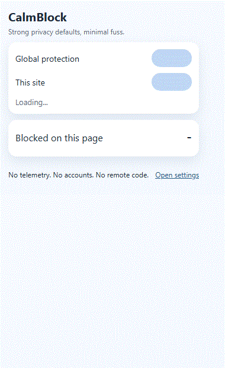
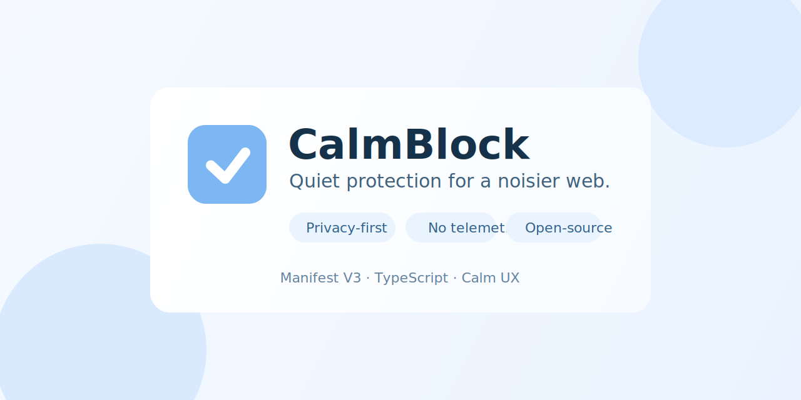
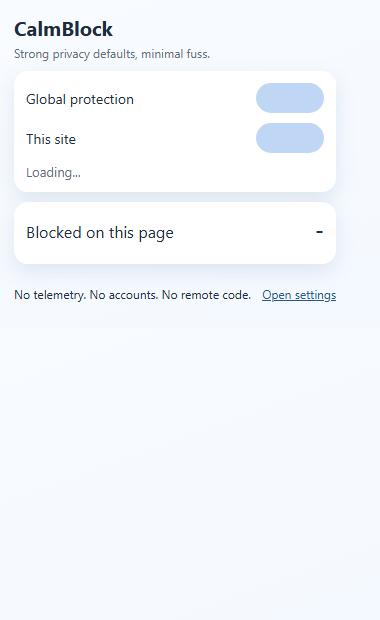

# CalmBlock




> Calm, privacy-first blocking for a noisier web.

No telemetry. No analytics. No remote code. No accounts.



CalmBlock is a browser extension for people who want strong defaults and simple controls without drowning in advanced settings.

It is intentionally scoped: practical protection, low-friction UX, and contributor-friendly architecture.

## Preview

Popup preview from local build:



## At A Glance

- Privacy-first model with explicit non-goals
- Manifest V3 and DNR-first architecture
- Cross-browser target: Chrome, Edge, Firefox
- Local-first behavior and conservative defaults

## Install

### Option A: Quick package files (recommended)

Produce ready-to-share zip packages:

```bash
npm install
npm run package:all
```

Generated files:

- `dist/packages/calmblock-chrome-v<version>.zip`
- `dist/packages/calmblock-firefox-v<version>.zip`

Then:

- Chrome/Edge: unzip `calmblock-chrome-...zip`, then use `Load unpacked` on the extracted folder.
- Firefox: unzip `calmblock-firefox-...zip`, then load `manifest.json` from `about:debugging#/runtime/this-firefox`.

### Option B: Direct build output

1. Clone and install dependencies:

```bash
npm install
```

2. Build extension bundles:

```bash
npm run build
```

3. Load unpacked in your browser:
- Chrome/Edge:
  - Open extension management page
  - Enable Developer mode
  - Click `Load unpacked`
  - Select `dist/chrome`
- Firefox:
  - Open `about:debugging#/runtime/this-firefox`
  - Click `Load Temporary Add-on...`
  - Select `dist/firefox/manifest.json`

## Development

```bash
npm run typecheck
npm test
npm run build
```

Additional commands:

- `npm run build:chrome`
- `npm run build:firefox`
- `npm run lint`

## Project Shape

- `src/background`: startup, migration, ruleset sync, popup APIs
- `src/content`: cosmetic filtering and annoyance suppression
- `src/popup`: fast controls for global/site behavior
- `src/options`: groups, allowlist, import/export, advanced toggle
- `src/shared`: stores, adapters, contracts, DNR helpers
- `public/rules`: packaged DNR rules (`ads`, `trackers`, `annoyances`, `strict`)
- `tests`: unit + content + integration-style tests

## Scope And Limitations

CalmBlock is a meaningful MVP baseline, not a maximalist parity clone.

Known limits:

- DNR constraints vs full ABP/uBO syntax
- Conservative anti-adblock handling
- Strict mode can break some sites
- No remote list update pipeline by design

## Privacy Model

- no telemetry
- no analytics SDKs
- no remote logging
- no accounts/cloud sync
- no remote code execution

Advanced debug behavior remains local-only and opt-in.

## Support

CalmBlock is maintained as a volunteer open-source project.

If you want to support sustainability, the support path is intentionally quiet and optional.

- [Support CalmBlock](./SUPPORT.md)

## Contributing

- [CONTRIBUTING.md](./CONTRIBUTING.md)
- [ROADMAP.md](./ROADMAP.md)
- [CHANGELOG.md](./CHANGELOG.md)
- [RELEASE_READINESS.md](./RELEASE_READINESS.md)
- [RELEASE_TEMPLATE.md](./RELEASE_TEMPLATE.md)
- [v0.1.0-alpha draft notes](./releases/v0.1.0-alpha.md)
- [SECURITY.md](./.github/SECURITY.md)
