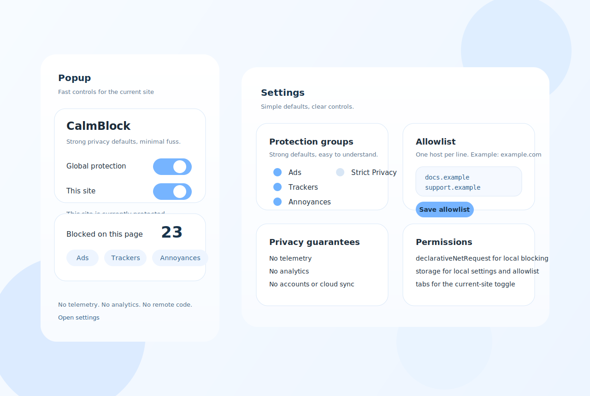

# CalmBlock


> Calm, privacy-first blocking for a noisier web.

No telemetry. No analytics. No remote code. No accounts.

CalmBlock is a browser extension for people who want strong defaults and simple controls without drowning in advanced settings.

It is intentionally scoped: practical protection, low-friction UX, and contributor-friendly architecture.

Current release line: `v0.1.1` (beta-ready open-source baseline, pre-certification).

## Interface

A lightweight overview of the popup and settings surfaces:



## At A Glance

- Privacy-first model with explicit non-goals
- Manifest V3 and DNR-first architecture
- Cross-browser target: official Chromium and Firefox families, plus Safari and Orion validation lanes
- Local-first behavior and conservative defaults

## Browser Support

CalmBlock ships two desktop extension builds:

- `chrome`: Chrome, Edge, Brave, Vivaldi, Opera, Arc, and Yandex.
- `firefox`: Firefox and compatible Firefox-based browsers such as LibreWolf, Waterfox, Floorp, and Zen.

| Support tier | Browsers | Build | Contract level |
| --- | --- | --- | --- |
| Certification-target (Chromium) | Chrome, Edge, Brave, Vivaldi, Opera, Arc, Yandex | `chrome` | Becomes official after release-matrix evidence is published for that release line |
| Certification-target (Firefox family) | Firefox (reference), LibreWolf, Waterfox, Floorp, Zen | `firefox` | Becomes official after release-matrix evidence is published for that release line |
| Gated / under validation | Orion | `chrome` first, `firefox` comparison | Official only after Orion gate criteria are met |
| Gated / under validation | Safari | none yet | Separate Apple packaging and review lane required before official support |

Browser notes:

- Official support in CalmBlock means published release evidence, not "might work" language.
- Current maturity: support contract is defined, but `v0.1.1` still uses a pre-certification matrix template.
- The single official package for all seven Chromium browsers is `calmblock-chrome-v<version>.zip`.
- The single official package for the full Firefox family is `calmblock-firefox-v<version>.zip`, with Firefox as the reference target.
- Orion is a gated promotion lane: start with `chrome`, compare with `firefox` when behavior is unclear, and require two consecutive passing releases before Official status.
- Safari is a separate workstream and needs its own Apple packaging, distribution, and review lane before it can become Official.
- Operational source of truth: [docs/release-browser-program.md](./docs/release-browser-program.md)
- Full support contract: [docs/browser-support.md](./docs/browser-support.md)
- Per-release certification worksheet: [docs/release-browser-matrix.md](./docs/release-browser-matrix.md)
- Chromium smoke-test checklist: [docs/chromium-smoke-checklist.md](./docs/chromium-smoke-checklist.md)
- Firefox-family smoke-test checklist: [docs/firefox-smoke-checklist.md](./docs/firefox-smoke-checklist.md)
- Orion smoke-test checklist: [docs/orion-smoke-checklist.md](./docs/orion-smoke-checklist.md)
- Safari workstream plan: [docs/safari-support.md](./docs/safari-support.md)
- Safari smoke-test checklist: [docs/safari-smoke-checklist.md](./docs/safari-smoke-checklist.md)
- UI i18n rollout plan: [docs/ui-i18n-plan.md](./docs/ui-i18n-plan.md)

## Install

### Option A: Quick package files (recommended)

Produce ready-to-share zip packages:

```bash
npm install
npm run package:all
```

Generated files:

- `dist/packages/calmblock-chrome-v<version>.zip`
- `dist/packages/calmblock-firefox-v<version>.zip`

Then:

- Official Chromium browsers (`Chrome`, `Edge`, `Brave`, `Vivaldi`, `Opera`, `Arc`, `Yandex`): unzip `calmblock-chrome-...zip`, then use `Load unpacked` on the extracted folder.
- Official Firefox-family browsers (`Firefox`, `LibreWolf`, `Waterfox`, `Floorp`, `Zen`): unzip `calmblock-firefox-...zip`, then load `manifest.json` from `about:debugging#/runtime/this-firefox`.

Safari note:

- Safari is not served by either current zip artifact.
- Safari support will require an Apple-specific packaging lane; see `docs/safari-support.md`.

Chromium official support note:

- Use the same `chrome` package for all official Chromium browsers.
- Chromium release certification is release-blocking for all seven browsers in this family.
- If a browser has a built-in blocker or filtering layer, disable it while validating CalmBlock behavior to avoid double-blocking noise.
- Browser-specific differences and triage notes are tracked in `docs/release-browser-program.md`.

Firefox-family official support note:

- Use the same `firefox` package for Firefox, LibreWolf, Waterfox, Floorp, and Zen.
- Firefox-family release certification is release-blocking for all five browsers in this family.
- Firefox is the reference release target for feature parity and regression checks.
- If optional permission or DNR feedback behavior differs by browser/version, CalmBlock must still preserve clear fallback behavior and document the difference.
- Private browsing defaults and ESR/stable lag differences are part of release review for this family.
- Family-specific known differences are tracked in `docs/release-browser-program.md`.

Orion gated support note:

- Orion validation starts with the `chrome` artifact as the primary path.
- Orion promotion work also includes `firefox` artifact comparison when evaluating compatibility or unexplained regressions.
- Orion stays "gated / under validation" until it passes the Orion checklist in two consecutive releases.
- Orion API completeness, compatibility mode behavior, built-in blocking, and browser version maturity can all affect results, so validation is mandatory before official claims.

Safari workstream note:

- Safari support is a declared target, but not yet a shipped artifact lane.
- Apple packaging and distribution requirements are separate from the current zip-based browser flow.
- Current planning and next steps are tracked in `docs/safari-support.md`.

### Option B: Direct build output

1. Clone and install dependencies:

```bash
npm install
```

2. Build extension bundles:

```bash
npm run build
```

3. Load unpacked in your browser:
- Official Chromium browsers:
  - Open extension management page
  - Enable Developer mode
  - Click `Load unpacked`
  - Select `dist/chrome`
- Official Firefox-family browsers:
  - Open `about:debugging#/runtime/this-firefox`
  - Click `Load Temporary Add-on...`
  - Select `dist/firefox/manifest.json`

## Development

```bash
npm run typecheck
npm test
npm run build
```

Additional commands:

- `npm run build:chrome`
- `npm run build:firefox`
- `npm run safari:plan`
- `npm run lint`

## Project Shape

- `src/background`: startup, migration, ruleset sync, popup APIs
- `src/content`: cosmetic filtering and annoyance suppression
- `src/popup`: fast controls for global/site behavior
- `src/options`: groups, allowlist, import/export, advanced toggle
- `src/shared`: stores, adapters, contracts, DNR helpers
- `scripts/rules`: ruleset source lists + reproducible generation pipeline
- `public/rules`: generated packaged DNR rules (`ads`, `trackers`, `annoyances`, `strict`)
- `tests`: unit + content + integration-style tests

Rules pipeline details:

- [rules/README.md](./scripts/rules/README.md)

## Scope And Limitations

CalmBlock is a meaningful MVP baseline, not a maximalist parity clone.

Known limits:

- DNR constraints vs full ABP/uBO syntax and scriptlet behavior
- Conservative anti-adblock handling (best effort, not a bypass product)
- Strict mode can break some sites or login/payment surfaces
- No remote list update pipeline by design (rules update with releases)
- Live per-tab block counters depend on optional browser feedback capability
- Browser forks can diverge in API completeness, permission prompts, and extension review/distribution paths

## Permission Rationale

CalmBlock requests only permissions needed for local blocking and clear UX:

- `declarativeNetRequest`: enforce packaged local network rules
- `storage`: save settings and allowlist locally
- `tabs` + `activeTab`: determine current host and keep popup/site toggle fast
- `<all_urls>` host access: apply blocking/cosmetic behavior on visited sites
- `declarativeNetRequestFeedback` (optional): enables live block counters in popup

No permission is used for telemetry, remote logging, account sync, or hidden data collection.

Live counter behavior:

- If optional feedback permission is granted, popup shows live blocked-request totals and category counts.
- If it is not granted, blocking still works normally and popup shows a clear "counters unavailable" fallback state.

## What Is Not Blocked

CalmBlock intentionally does not target these classes in this phase:

- paywall bypass logic
- universal anti-adblock circumvention
- first-party product UI that is not a clear annoyance/tracking signal
- authenticated app break-fix heuristics without reproducible reports
- remote "hotfix script" behavior outside normal release updates

## Privacy Model

- no telemetry
- no analytics SDKs
- no remote logging
- no accounts/cloud sync
- no remote code execution

Advanced debug behavior remains local-only and opt-in.

## Support

CalmBlock is maintained as a volunteer open-source project.

If you want to support sustainability, the support path is intentionally quiet and optional.

- [Support CalmBlock](./SUPPORT.md)

## Contributing

- [CONTRIBUTING.md](./CONTRIBUTING.md)
- [Site breakage issue template](./.github/ISSUE_TEMPLATE/site_breakage.md)
- [ROADMAP.md](./ROADMAP.md)
- [CHANGELOG.md](./CHANGELOG.md)
- [RELEASE_READINESS.md](./RELEASE_READINESS.md)
- [RELEASE_TEMPLATE.md](./RELEASE_TEMPLATE.md)
- [v0.1.0-alpha draft notes](./releases/v0.1.0-alpha.md)
- [SECURITY.md](./.github/SECURITY.md)
